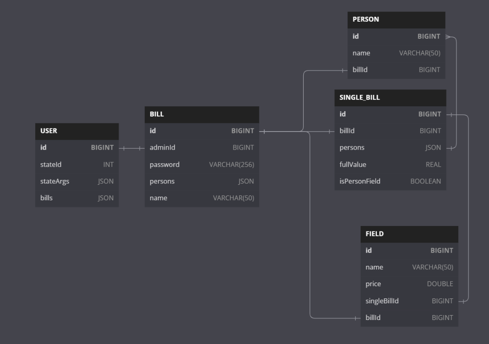

# PHP-Bill-Splitter

### Проект выполняет Миленин Иван

## Описание реализованного проекта:

[🧾 По этой ссылке можно получить информацию программной части реализованного проекта](./README.md#vk---course)

[🌐 ССЫЛКА НА БОТА](https://vk.com/public217261141)
## Проблема

Представим ситуацию: Коля, Васи, и Миша решили вместе сходить в какой-нибудь бар. Ребята на всю компанию заказали набор
закусок, Вася с Мишей заказали себе на двоих набор хот-догов, Коля с Васей взяли на двоих пиццу и Миша решил
дополнительно взять себе жареных пельменей *(также каждый взял себе по какому-нибудь напитку)*.

Спустя примерно полтора часа посиделок приходит общий счет. Коля, как самый трезвый и ответственный, решил все оплатить
сам и потом сказать каждому, какую сумму ему должны вернуть друзья за каждую позицию. Но придя домой он понял, что
просто и легко это не удастся, потому что нужно делить определенные позиции на нескольких человек. Да и вдруг он
перепутает позиции разных людей? Получается не порядок...

Так как наш Коля программист, он решил запилить ~~собственное мобильное приложение~~
собственного бота с бэкендом, ~~авторизацией~~ и уведомлялками.

**Чего хочет сделать наш Коля?** Он хочет, чтобы самый ответственный из компании мог создать "комнату", в которую будут
добавлены необходимые пользователи. Далее каждый может вписать то, что он съел и с кем он это съел, а по необходимости
получить счёт с уже посчитанными и разделёнными позициями.

**Что хочет увидеть Коля после получения всех данных?**

*P.S Каждая таблица скорее всего будет отправляться отдельным сообщением*

```
+-----------------------------+  +-----------------------------+
| Пользователи:               |  | Пользователи:               |
| [Коля] + [Вася] + [Миша]    |  | [Вася] + [Миша]             |
+-----------------------------+  +-----------------------------+
| Сырный соус - 40 руб.       |  | Хот-доги - 480 руб.         |
+-----------------------------+  +-----------------------------+
| Вкусный набор - 980 руб.    |  |                             |
+-----------------------------+  +-----------------------------+
|                             |  | Общая сумма: 480 руб.       |
+-----------------------------+  | Разделенная сумма: 240 руб. |
| Общая сумма: 1020 руб.      |  +-----------------------------+
| Разделенная сумма: 340 руб. |  
+-----------------------------+ 
```

```
+-----------------------------+
| Пользователи:               |
| [Коля] + [Вася]             |
+-----------------------------+
| Пицца - 520 руб.            |
+-----------------------------+
|                             |
+-----------------------------+
| Общая сумма: 520 руб.       |
| Разделенная сумма: 260 руб. |
+-----------------------------+
```

```
+-----------------------------+ +-----------------------------+
| Чек:                        | | Чек:                        |
| [Коля]                      | | [Вася]                      |
+-----------------------------+ +-----------------------------+
| Вода - 200 руб.             | | Кола - 150 руб.             |
+-----------------------------+ +-----------------------------+
|                             | |                             |
+-----------------------------+ +-----------------------------+
| [Коля] + [Вася] + [Миша] -  | | [Коля] + [Вася] + [Миша] -  |
| 340 руб.                    | | 340 руб.                    |
+-----------------------------+ +-----------------------------+
| [Коля] + [Вася] - 260 руб.  | | [Коля] + [Вася] - 260 руб.  |
+-----------------------------+ +-----------------------------+
|                             | |                             |
+-----------------------------+ +-----------------------------+
| Общая сумма: 700 руб.       | | Общая сумма: 650 руб.       |
+-----------------------------+ +-----------------------------+
``` 

```
+-----------------------------+
| Чек:                        |
| [Миша]                      |
+-----------------------------+
| Содовая - 380 руб.          |
+-----------------------------+
| Жареные пельмени - 360 руб. |
+-----------------------------+
|                             |
+-----------------------------+
| [Коля] + [Вася] + [Миша] -  |
| 340 руб.                    |
+-----------------------------+
|                             |
+-----------------------------+
| Общая сумма: 1080 руб.      |
+-----------------------------+
``` 

## Описание проекта (MVP)

Проект подразумевает создание бота, способного предоставлять пользователям возможность разделения общих счетов с
демонстрацией финальной суммы и таблицей для каждого участника "комнаты".

## Planned features

1) Производить "процентное разделение" позиций *(20% заплатит Миша, а остальные 80% Коля)*;
2) Отправлять уведомления об изменении в чеке *(в случае, если это затронуло пользователя)*;
3) Разработка user-friendly приложения, использующего реализованный **REST API**;
4) Показ красивых графиков для сравнения затраченных сумм каждым участником "комнаты";
5) ...

# VK - course

1) | ✅ | Проект написан на php. Если использованы другие языки, их использование должно быть обосновано
2) | ✅ | Используется хранилище данных с возможностью дальнейшего масштабирования нагрузки (хранение данных в файле
   таковым не считается)
3) | ✅ | Грамотно построена архитектура проекта (не весь код в одном файле, есть классы, разделение по слоям и т.д.)
4) | ✅ | Присутствует кэширование. Если его нет, то представлено обоснование, почему
5) | ❌ | Есть интеграционные тесты и unit тесты на места со сложной логикой
6) | ⚠️ | Дашборд с метриками
7) | ⚠️ | Автоматизация деплоя

✅ - Сделано;

⚠️- В разработке;

❌ - не сделано;

## DB

Итак, основным моим сердцем бота являлась база данных. Ниже представлено изображение связанных таблиц, и их параметров.
Для реализации проекта был выбран ```mySql```.



`USER` - Данные о пользователе. Хранит в себе `стейт` пользователя, его аргументы и доступные чеки.

`BILL` - Данные о чеке, пароль, id участников чека (НЕ USER) и прочую информацию.

`PERSON` - Участник чека. Храни в себе имя и то, с каким чеком он связан.

`SINGLE_BILL` - Таблица из группы пользователей (либо с одним). К данной таблице подключаются поля из `FIELD`, которые
будут принадлежать к входящему туда набору `PERSON`.

`FIELD` - Блюдо/напиток (элемент чека).


## States

Итак, мне захотелось разделить логику отдельных этапов взаимодействия с пользователем, думая над решением это проблемы я
решил использовать что-то похожее на "Фрагменты" из андроид-приложений (с их навигацией).
Данный бот активно использует клавиатуру для взаимодействия с пользователем, поэтому внутри находятся `payload`, который
позднее обрабатывается в стейтах (будем называть наследников класса ```BotState.php``` так).

Также в ```BotState.php```были помещены полезные навигационные методы (когда из одного состояния мы можем перейти в
другое)

_Также тут мог быть граф состояний, но его делать очень долго :(_

## Обработка событий

```index.php``` получает на вход событие и в зависимости от его типа вероятнее всего передает его в
класс ```./bot/bot.php```.

Далее происходит определение того, в каком состоянии находится пользователь. Для этого я просто обращаюсь к базе данных
и делаю что-то отдаленное напоминающее на Dagger.

В директории ```./bot/di/*``` у меня представлены то, какие клавиатуры и классы вызывать в зависимости от текущего
состояния пользователя. Вот они и вызываются из ```./bot/bot.php```.

Далее в событии сперва обрабатываются payload-ы, если они есть, а в дальнейшем обрабатываются уже сообщения (или
выводятся сообщения об ошибке и некорректном событии).

## Cache

Я долго думал, что можно кешировать для данного пункта и пришел к выводу, что наилучшим кандидатом для этого будет поле
```persons``` из таблицы ```BILL```. Этот параметр отправляет `id` пользователей, которые прописаны в чеке. Для
реализации был использован `MemCached` (см. `bot/config/cache.php`).

## File structure

Не знаю, стоит ли об этом вообще писать, но пусть это будет относиться к пункту с "Грамотно построенной архитектурой
проекта".

Основные методы хранятся в директории `./bot/`, поэтому ниже представлено её описание:

```
bot/
├── actions    | Директория состояний (в них находится основная логика);
├── class      | Директория с классами таблиц из mySql;
├── config     | Конфиги и настройка mySql и Memcached;
├── di         | Зависимые классы клавиатур и состояний от номера состояния;
├── models     | Util - файлы;
└── res        | Файлы с ресурсами (текст, клавиатуры и прочее);
```
